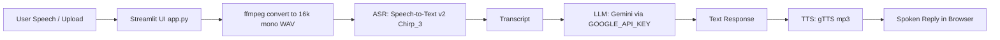

# Google Cloud Billing Voice Bot (Gbot)

A serverless voice assistant for Google Cloud Billing support.

---

## Architecture
1. **Streamlit UI (`app.py`)**
   - Captures microphone audio (or accepts uploads).
   - Saves to a temp file and converts to 16k mono WAV via ffmpeg (Cloud-Run safe).
2. **ASR: Speech-to-Text v2 (Chirp 3) (`utils/audio_utils.py`)**
   - Calls regional STT v2 endpoint (`us-speech.googleapis.com`).
   - Uses ephemeral recognizer: `projects/{project}/locations/us/recognizers/_`
   - Model: `chirp_3`
3. **LLM: Gemini (`utils/llm_utils.py`)**
   - Uses `GOOGLE_API_KEY` and `LLM_MODEL` (default: `gemini-2.5-flash-lite`).
4. **TTS: gTTS (`utils/audio_utils.py`)**
   - Converts Gemini response to mp3 and plays it in browser.
5. **Deploy**
   - Container built with Cloud Build → stored in Artifact Registry/GCR → deployed to Cloud Run.

### Mermaid diagram
